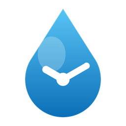

<p align="center">
  
</p>

<h1 align="center">Irrigation AI Scheduler</h1>

<p align="center">
  A Home Assistant integration that sequences a shared-pump irrigation system and
  adapts it every night with an LLM — configured entirely from the UI, no YAML.
</p>

<p align="center">
  <a href="https://github.com/fdebrus/ha-ai-irrigation/actions/workflows/validate.yml"></a>
  <a href="https://github.com/hacs/integration"></a>
  
  
  <a href="LICENSE"></a>
</p>

---

## Why this exists

Most irrigation setups have one thing in common and one integration rarely
respects it: **a single pump feeds every zone, so only one zone can run at a
time.** Run two at once and the pressure collapses; leave a valve open overnight
and you drown a bed. This integration treats that constraint as the centre of
the design rather than an afterthought.

It is a **scheduler, not a device driver**. Your valves, buttons and pump already
exist in Home Assistant — this integration only calls services on them, works out
*when* each zone should run so they never collide, and once a night asks an LLM to
nudge the setpoints for the weather. It never talks to hardware directly and never
lets the AI open, close or cancel a valve.

## Highlights

- 🚰 **One pump, one zone at a time.** Start times are *derived* from a morning
  base, an evening base and a margin — never hand-edited — so two zones can never
  share the pump. Change a duration and the whole sequence re-derives itself.
- 🔌 **Three zone types behind one interface** — a plain valve/switch, a
  multi-outlet distributor, or a pair of start/stop buttons with no state.
- 🧠 **A nightly AI plan** that proposes durations, schedules, second runs and the
  rain threshold — reasoning in *litres delivered*, not blanket percentages —
  while every value is clamped and the failure mode is "yesterday's plan, unchanged".
- 🌧️ **Weather-aware rain skip** on the forecast probability, where a *missing*
  forecast waters the garden rather than being read as "0 %".
- 🔁 **Runs survive a restart.** A valve is never left open because Home Assistant
  rebooted mid-cycle; a run whose end passed while HA was down closes immediately.
- 🩺 **It tells you when something is wrong** — a dry pump, a renamed valve, or an
  AI plan that would have collided all raise repair issues.
- 🖐️ **Opt-in manual-run adoption**, per zone, so a valve opened from HomeKit or by
  hand still gets closed after its duration — without hijacking every manual open.

## How it works

### One pump, derived start times

You set three things: the **morning base** (e.g. 05:30), the **evening base**
(19:00) and the **margin** between zones. From those, plus each zone's order and
occupancy, the integration derives every zone's `Morning start` and `Evening
start` and lays them end to end so no two runs overlap. That's why the start
times are **read-only sensors**, not editable `time` entities — editing one
directly would break the single-pump guarantee.

### Zone drivers

Every zone is one of three shapes. Occupancy — how long the pump is tied up — is
computed per type, which is why a uniform percentage change across zones is always
wrong (flow rates can differ five-fold).

| Driver | Hardware | Notes |
|---|---|---|
| **Valve** | `valve.*` or `switch.*` | Opened and closed directly. The common case. |
| **Distributor** | one valve → a mechanical multi-outlet distributor | Opens and advances one outlet per cycle; occupies `outlets × duration + gaps`. |
| **Buttons** | a start button and a stop button | No readable state — the run timer is the only truth. Never watched for adoption. |

### The nightly AI plan

At the configured plan time, the integration builds a briefing from each zone's
computed litres-per-run and the forecast, and asks an [`ai_task`](https://www.home-assistant.io/integrations/ai_task/)
entity for a structured plan. **The AI writes setpoints, never actions.** It may
propose per-zone duration, schedule, second run and rain threshold — and *enabled*
only for zones you flag **seasonal**. Every field then passes through a clamp that
falls back to the current value, running zones are left untouched, and if the
proposed plan would ever overlap on the pump it is rolled back and a repair issue
is raised. Any error at all — a malformed response, a service failure — keeps
yesterday's plan. The reasoning is stored on `sensor.irrigation_daily_plan` under
the `narrative` attribute. See [`docs/ai-contract.md`](docs/ai-contract.md) for the
full contract.

The AI layer is entirely optional: turn off **AI plan** and the schedule is yours.

### Rain skip

With **Rain skip** on, a scheduled run is skipped when the forecast probability
meets the **Rain threshold** (a percentage the AI may tune within a safe band).
The daily forecast is used first; if your provider publishes no probability
there (Met.no's daily forecast, for one), the integration falls back to the
hourly forecast and takes the maximum over the next 24 hours — the
`Rain probability` sensor's `source` attribute says which one was used. When no
probability is available at all the run is **not** skipped — a missing forecast
is never treated as dry.

### Restart safety

Live runs are persisted and re-armed on startup. If HA was down when a run should
have ended, its valve is closed the moment the integration loads. A valve left
open overnight is the worst failure this project guards against.

## Install

### HACS (recommended)

1. HACS → three-dot menu → **Custom repositories** → add
   `https://github.com/fdebrus/ha-ai-irrigation` as an **Integration**.
2. Install **Irrigation Scheduler**, then restart Home Assistant.
3. **Settings → Devices & Services → Add Integration → Irrigation Scheduler.**

### Manual

Copy `custom_components/irrigation_scheduler` into your Home Assistant
`config/custom_components/` directory and restart.

> Requires Home Assistant **2025.6** or newer.

## Set up the hub

The first step configures the shared hardware and timing. All fields are optional
except where your setup needs them.

| Field | What it's for |
|---|---|
| **Weather entity** | Drives the rain skip and feeds the AI forecast. Omit to disable both. |
| **Pump running binary sensor** | Enables the no-flow watchdog. Omit and the watchdog stays inert. |
| **AI task entity** | The `ai_task` entity used for the nightly plan. Omit to run without AI. |
| **Morning sequence start** | Base time the morning sequence is laid out from. |
| **Evening sequence start** | Base time for the optional second runs. |
| **AI plan time** | When the nightly plan is generated. |
| **Margin between zones** | Minutes of gap inserted between consecutive runs. |

## Add zones

On the integration page, **Add zone** once per zone. The first step describes the
zone; the second asks only for the entities its driver needs.

**Common fields** — name, driver, watering order, a description (handed to the AI),
hose length and emitter rate (used to compute litres), default/min/max duration,
default schedule, **Seasonal** (may the AI enable/disable it), and **Adopt manual
runs**.

**Driver-specific step**

- **Valve** — the valve or switch entity.
- **Distributor** — the valve, the number of outlets, and the gap between them.
- **Buttons** — the start button and the stop button.

**Schedule presets:** Daily · Weekdays · Weekends · Mon/Wed/Fri · Tue/Thu/Sat ·
Mon/Thu.

## Entities

### Per zone

| Entity | Purpose |
|---|---|
| `switch.<zone>_enabled` | Include the zone in the schedule. |
| `switch.<zone>_second_run` | Add the evening run. |
| `number.<zone>_duration` | Run duration (minutes), bounded to the zone's limits. |
| `select.<zone>_schedule` | Which days it waters. |
| `sensor.<zone>_morning_start` | Derived morning start (read-only). |
| `sensor.<zone>_evening_start` | Derived evening start (read-only). |
| `sensor.<zone>_next_run` | Next scheduled run. |
| `sensor.<zone>_finishes_at` | When the current/next run ends. |
| `sensor.<zone>_status` | Idle / running / skipped, with the reason. |
| `button.<zone>_run_now` | Start the zone now. |
| `button.<zone>_stop` | Stop the zone now. |

### Hub

| Entity | Purpose |
|---|---|
| `switch.irrigation_master` | Master enable for the whole schedule. |
| `switch.irrigation_rain_skip` | Enable the rain skip. |
| `switch.irrigation_ai` | Enable the nightly AI plan. |
| `number.irrigation_rain_threshold` | Rain probability at which runs skip. |
| `time.irrigation_morning_base` | Morning sequence base. |
| `time.irrigation_evening_base` | Evening sequence base. |
| `time.irrigation_plan_at` | AI plan time. |
| `sensor.irrigation_rain_probability` | Latest forecast probability. |
| `sensor.irrigation_daily_plan` | Today's plan; reasoning in the `narrative` attribute. |
| `binary_sensor.irrigation_overlap` | On if two derived runs would collide (a bug). |
| `binary_sensor.irrigation_no_flow` | On if a zone runs but the pump reports no flow. |
| `button.irrigation_stop_all` | Stop every zone. |
| `button.irrigation_plan_now` | Generate the AI plan immediately. |

## Services

| Service | Target | Notes |
|---|---|---|
| `irrigation_scheduler.run_zone` | a zone's button entity | Optional `duration` (minutes); defaults to the zone's configured duration. |
| `irrigation_scheduler.stop_zone` | a zone's button entity | Stops the zone and cancels its run. |

## Manual-run adoption

Each zone has an **Adopt manual runs** option, **off by default**. When on,
opening the valve from outside the integration starts a tracked run that closes
after the zone's duration. When off, manual opens are left entirely alone. Button
zones are never adopted — they have no readable state. If a valve seems to close
itself a fixed interval after you open it by hand, this setting is the first thing
to check.

## When something's wrong

The integration surfaces problems as **repair issues** (Settings → System →
Repairs) rather than failing silently:

- **Pump reports no flow** — a zone has been open past the grace window but the
  pump sensor still reads off. Also raises `binary_sensor.irrigation_no_flow`.
- **Zone is missing an entity** — a configured valve or button was renamed or
  removed. Reconfigure the zone to point at the current entity.
- **AI plan created an overlap** — the proposed plan would have collided on the
  pump; it was rolled back to the previous plan. Please report it.

## Development

```bash
pip install -r requirements_dev.txt
pytest          # the pure core + the I/O shell
ruff check .
scripts/develop # a throwaway HA with this component mounted
```

The scheduling logic is pure and testable — the domain model and planner take no
`hass` and do no I/O — and the drivers, scheduler, config flow and AI layer are
the shell around it. Contributor notes live in [`CLAUDE.md`](CLAUDE.md); the AI
contract is in [`docs/ai-contract.md`](docs/ai-contract.md).

## License

[MIT](LICENSE).
